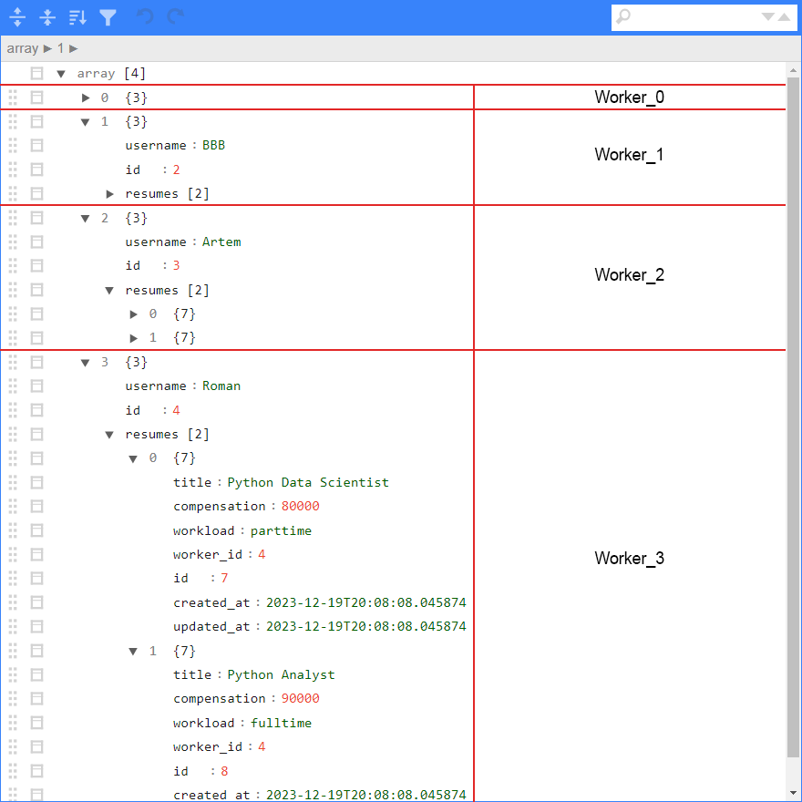
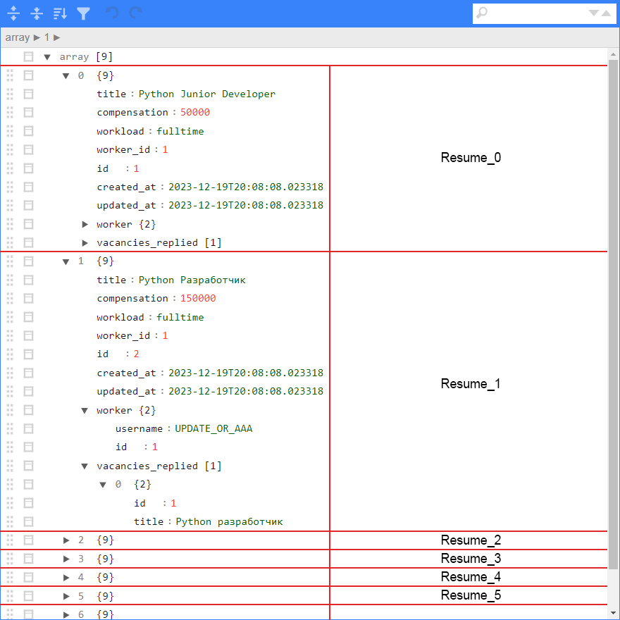

# Описание
> **Проект является обучающим материалом и содержит заметки по базовому функционалу SQLAlchemy.**
> 
> **Запросы к БД реализованы в стилях core и orm, а также представлены в синхронном и асинхронном вариантах.**
> 
## Вывод данных с помощью FastAPI и JsonEditor
> **На скриншотах вручную размечены блоки для удобства восприятия.**
> 
> **Чтобы посмотреть такую вложенную структуру, необходимо запустить `uvicorn` и открыть `index.html`**
 
### Работники с вложенными резюме

### Резюме с вложенными работниками и ответами на вакансии

